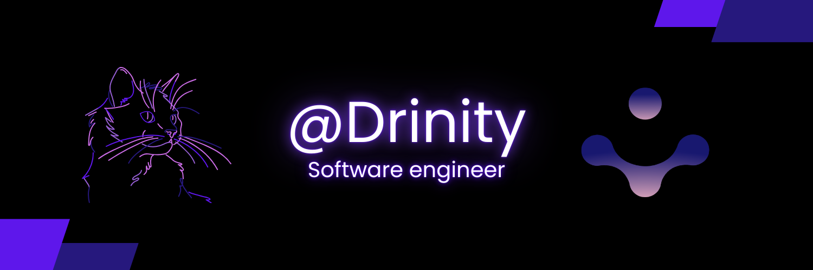

<h1 align="center">Hello, I'm Jesús Omar Raya Morales (Drinity) 👋</h1>

- [cite_start]🔭 I’m currently working on **Horus** and leading projects at **Override**.
- [cite_start]🌱 I’m currently focusing on **Rust** for high-performance software.
- [cite_start]🚀 Specialized in **Backend Development**, Clean Architecture, and SOLID principles[cite: 2, 6, 7].
- [cite_start]🏆 1st Place Winner at **Innovatec 2025** (Local & Regional) with Project Lyra[cite: 6, 9].
- [cite_start]✨ **CEO at Override**[cite: 7].
- [cite_start]📨 Feel free to talk to me: **drinity@override.com.mx** or **dritiny@proton.me**[cite: 3].

### 🛠️ Featured Projects & Achievements
* [cite_start]**Project Lyra:** 1st Place in Health & Technology categories (Innovatec 2025)[cite: 6, 9].
* [cite_start]**Project Quickness:** Modular microservices ecosystem for payment and access management.
* [cite_start]**STAK:** Robust tokenization and authentication system developed with FastAPI[cite: 6, 7].
* [cite_start]**Override Mindstack 2025:** Co-organizer and problem designer for the NP-Hard challenge "Quimera".

### ⚙️ &nbsp;GitHub Analytics

  
  

## Technologies I Know

  

### 📚 Education & Skills
* [cite_start]**Education:** B.S. in Computer Systems Engineering (2022 - Present).
* [cite_start]**Architectures:** Clean Architecture, Hexagonal.
* [cite_start]**Infrastructure:** Docker, Docker Compose, Google Cloud, Supabase, Vercel.
* [cite_start]**Languages:** Spanish (Native), English (Professional).

  <ul align="center">
    
<h2 style="display: inline-block">Connect with me 🤝</h2>

  </ul>

 

Last Edited on: 25/12/2025
